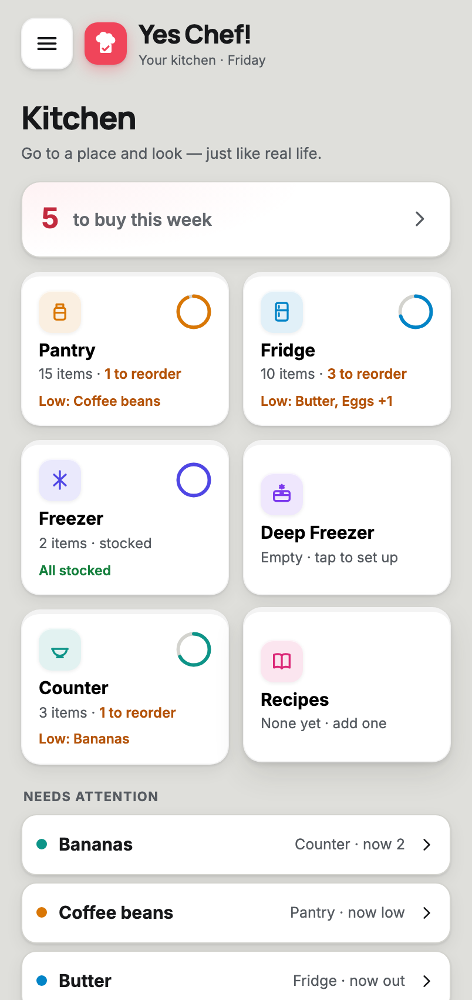
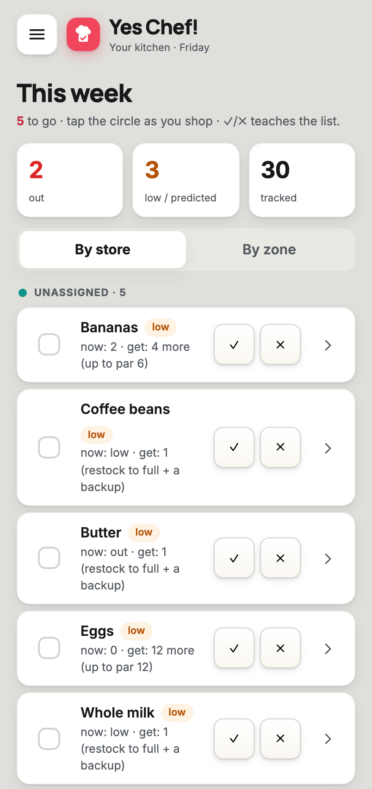
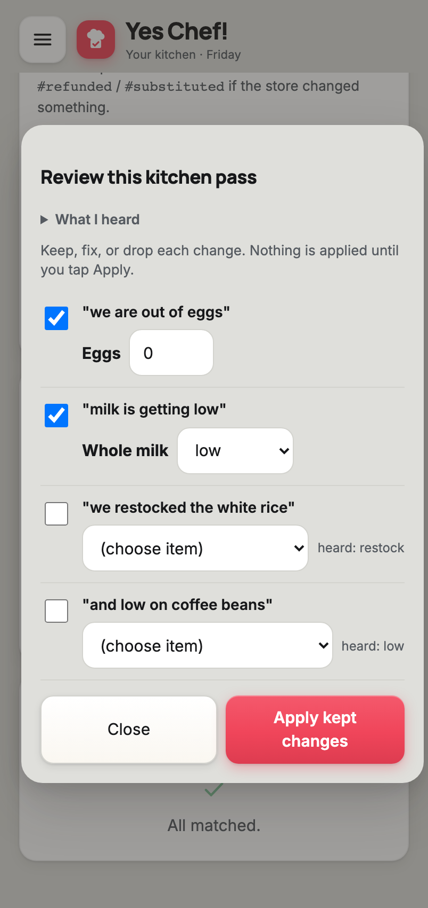

# Yes Chef!

A self-hosted app that keeps track of what food is in your kitchen and turns it into a
weekly shopping list — so you stop keeping a running "what do we need" list in your head.
Track pantry / fridge / freezer stock, let a consumption model predict what's running low,
and get a Sunday list of exactly what to reorder. Phone-first PWA, runs entirely on your
own hardware, no cloud account.

The standout feature: a **narration pipeline** — record a quick video walking your kitchen
("out of eggs, milk's getting low, restocked the rice"), and on-device speech-to-text turns
your words into a set of *proposed* inventory changes you review and apply. Nothing is ever
auto-applied; you stay in the loop.

## Screenshots

<table>
  <tr>
    <td width="33%"></td>
    <td width="33%"></td>
    <td width="33%"></td>
  </tr>
  <tr>
    <td align="center"><b>Kitchen</b><br/>zones, weekly to-buy, needs-attention</td>
    <td align="center"><b>This week's list</b><br/>✓/✗ verdicts teach the list</td>
    <td align="center"><b>Narration review</b><br/>spoken → proposed → you confirm</td>
  </tr>
</table>

## What it does

- **Inventory** across five zones (pantry, fridge, freezer, deep-freezer, counter), counted
  items or eyeballed levels.
- **Weekly shortfall list** — every staple at or below its reorder point, hard triggers plus
  `confirm?` predictions from a per-item consumption model. You order it; nothing auto-buys.
- **Fast capture** — paste a receipt, one-tap "out of X" quick-add, or record a kitchen-pass
  video. All names resolve through one alias table (no duplicate "milk" / "whole milk" forks).
- **Narration → review → apply** — speech-to-text (whisper.cpp) proposes changes; you keep,
  edit, or drop each one.
- **Recipes** — import by URL (JSON-LD), see what's cookable now, one-tap "I made this"
  decrements ingredients.
- **Report card** — precision/recall on the list's suggestions, so you can tell if it's
  actually earning its keep.
- **PWA** — installable, works on any phone on your network, no app store.

## Stack

- **TypeScript + Fastify** HTTP service; the inventory + reorder engine is the source of truth.
- **Node's built-in `node:sqlite`** (one file, no native build) behind a thin `db.ts` layer.
- **Vanilla HTML/JS** frontend — no build step, self-hosted fonts, offline service worker.
- **whisper.cpp + ffmpeg** for local speech-to-text (CPU-only, no GPU, no cloud).
- **Vitest** — 100+ tests; the Docker build fails on a red suite so a broken app can't ship.
- Requires **Node ≥ 22.5**.

## Run it locally

```bash
cd app
npm install
npm run migrate        # create the SQLite schema
npm run seed           # load sample staples for the default household
npm run start          # serve API + UI at http://localhost:3000
```

Open **http://localhost:3000**. Your staple list lives in `data/staples.json` (editable
data, not code — the field notes at the top explain every column).

Speech-to-text is optional and off by default; the app runs fully without it (paste a
transcript instead). To enable it, provide a whisper model — see `app/README.md`.

## Run it on your own server

The app is a single Docker container designed to run 24/7 on hardware you control. The SQLite
database lives on a mounted folder so it persists across restarts and is easy to back up.

- **On a home NAS** — **[app/DEPLOY-SYNOLOGY.md](./app/DEPLOY-SYNOLOGY.md)** is a click-by-click
  Synology guide (Container Manager + a zero-trust VPN for off-network access + backups).
- **On a VPS** — **[docs/DEPLOY-VPS.md](./docs/DEPLOY-VPS.md)** covers running it on a rented
  Linux server, reached privately over Tailscale or fronted by an authenticating reverse proxy.

> **Security note:** Yes Chef! has **no built-in authentication** — it trusts anyone who can
> reach it, which is why it's designed for a private LAN or VPN. Never expose its port directly
> to the public internet. Both deploy guides above keep it private; the VPS guide explains the
> options in detail. Authentication and multi-household support are on the roadmap; until then,
> access control is the deployment's job.

## How it's built

- **[app/README.md](./app/README.md)** — architecture, the four inventory flows, the API, and
  the deployment build path.
- **[Spec — Canonical Item Resolution](./Spec%20-%20Canonical%20Item%20Resolution.md)** — how
  one item stays one item across receipts, speech, and recipes (the anti-fork alias engine).
- **[Spec — Narration Grammar & Draft-Chart JSON](./Spec%20-%20Narration%20Grammar%20and%20Draft-Chart%20JSON.md)**
  — the spoken-mention → reviewable-change grammar.
- **[docs/SPEC-narration-pipeline.md](./docs/SPEC-narration-pipeline.md)** — the video →
  transcript → drafts → apply pipeline as built.
- **[Stage-1 MVP — Cut Sheet](./Stage-1%20MVP%20-%20Cut%20Sheet.md)** — the scope line for
  what shipped first.

## Design principles

- **Human-in-the-loop, no auto-payment** — the app prepares the list; a person orders and pays.
- **Inventory is the hard problem** — everything optimizes for keeping the count honest cheaply.
- **Counts are estimates, never asserted** — prediction and narration *propose*; you confirm.
- **Local-first** — your data stays on your hardware; no external services, no CDN calls.
